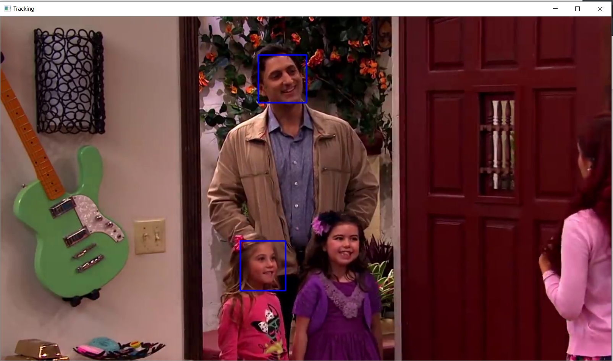

# TrackingSystem
A lot of machine learning applications like detecting a object needs a dataset with boundingbox coordinates. In a lot of case specified, dataset with bounding box of that object is not available. This system will allow the user to draw the bounding box on the video along with the label and it will write the bounding box corordnates along with the name in a file. This system also allows the user to label multiple differnt object in a video at different times.

# How to Use
- Press "s" to draw multiple bounding box on the video.
- Press Enter in order to select next bounding box.
- Press "q" in order to keep traking the object.
- If any new object needs to be tracked or if the current object tracker  needs to be re-intialize, Press "s".
- Pres esc to terminate the process.

# Visual Result

# Language Used
Python, Tensorflow, OpenCV

# Coming Updates
- Tracking custom Facial keypoints.
